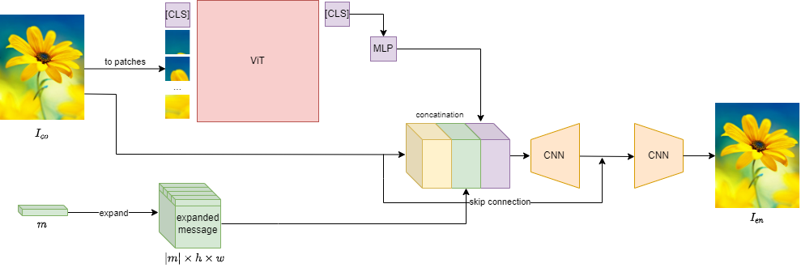

# Transformark
This is a final project in the course "Deep Learning for Computer Vision" at Weizmann Institute of Science, Rehovot, Israel.  
Transformark is an end-to-end infrastructure for Digital Watermarking based on Vision Transformers.  
Our work is based on the paper "HiDDeN: Hiding Data With Deep Networks" by Jiren Zhu, Russell Kaplan, Justin Johnson, and Li Fei-Fei: https://arxiv.org/abs/1807.09937  
The implementation is based on this implementation of HiDDeN: https://github.com/ando-khachatryan/HiDDeN  
For running instructions, please look at the readme file inside the directory HiDDeN-master.  
For more details on our work, please read our final report named Transformark_Final_Report.pdf.  
For running results with various of noises and different models, look at the running_results directory.  

## Our Architecture (first attempt)

  

